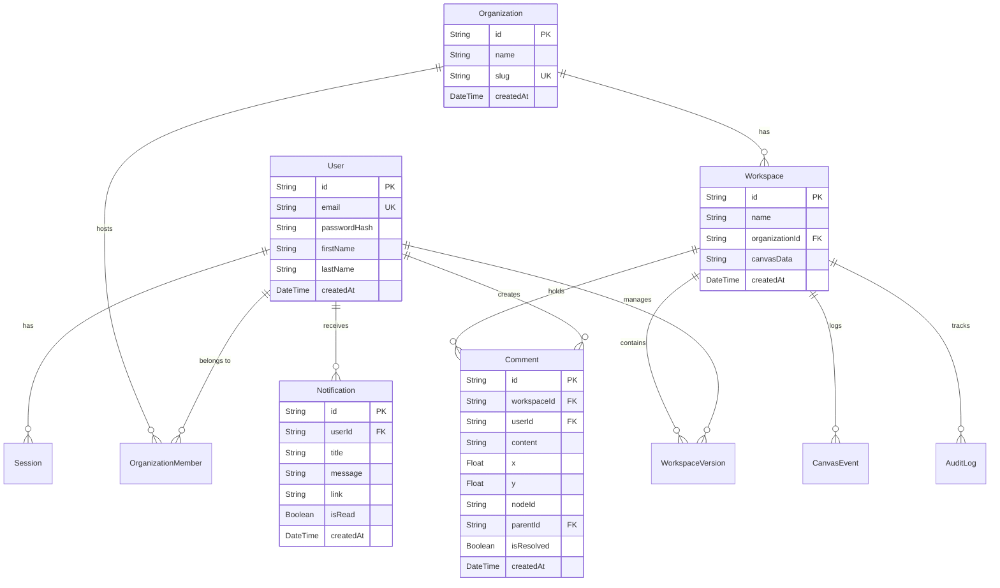

# Entity Relationship (ER) Diagram

This diagram displays the relational mapping of the database models in PostgreSQL using Prisma.

```mermaid
erDiagram
    User ||--o{ Session : "has"
    User ||--o{ OrganizationMember : "belongs to"
    User ||--o{ Comment : "creates"
    User ||--o{ WorkspaceVersion : "manages"
    User ||--o{ Notification : "receives"
    
    Organization ||--o{ OrganizationMember : "hosts"
    Organization ||--o{ Workspace : "has"
    
    Workspace ||--o{ CanvasEvent : "logs"
    Workspace ||--o{ Comment : "holds"
    Workspace ||--o{ WorkspaceVersion : "contains"
    Workspace ||--o{ AuditLog : "tracks"

    User {
        String id PK
        String email UK
        String passwordHash
        String firstName
        String lastName
        DateTime createdAt
    }

    Organization {
        String id PK
        String name
        String slug UK
        DateTime createdAt
    }

    Workspace {
        String id PK
        String name
        String organizationId FK
        String canvasData
        DateTime createdAt
    }

    Comment {
        String id PK
        String workspaceId FK
        String userId FK
        String content
        Float x
        Float y
        String nodeId
        String parentId FK
        Boolean isResolved
        DateTime createdAt
    }

    Notification {
        String id PK
        String userId FK
        String title
        String message
        String link
        Boolean isRead
        DateTime createdAt
    }
```
